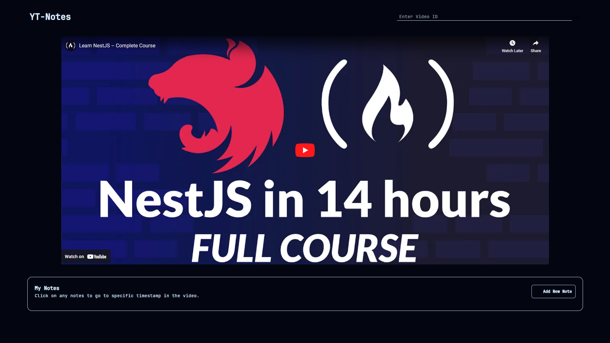

# YT-Notes


YT-Notes is a web application that allows users to take notes on YouTube videos. Users can enter a video ID, watch the video, and create timestamped notes that link directly to specific points in the video.

## Features

- **Video Playback**: Enter a YouTube video ID to load and play the video.
- **Timestamped Notes**: Create notes that link directly to specific timestamps in the video.
- **Note Navigation**: Click on any note to jump to the corresponding timestamp in the video.
- **Simple Interface**: Clean and easy-to-use interface for an optimal user experience.

## Usage

1. **Enter Video ID**: In the input field at the top of the page, enter the ID of the YouTube video you want to watch and take notes on. The video will load and start playing.
2. **Watch Video**: Watch the video within the application. Use the standard YouTube controls for play, pause, volume, etc.
3. **Add Notes**: To add a new note, click the "Add New Note" button. A new note entry field will appear.
4. **Create Timestamped Notes**: Write your note in the provided field. The note will be automatically linked to the current timestamp of the video.
5. **Navigate Notes**: Click on any of your notes listed under "My Notes" to jump to the corresponding timestamp in the video.

### Technologies Used

- **React**: The front-end library for building user interfaces.
- **Tailwind CSS**: A utility-first CSS framework for styling the user interface.
- **React YouTube**: A React component for playing YouTube videos.
- **React Hot Toast**: A toast notification library for React applications, used for displaying notifications.
- **React Icons**: A library providing popular icon packs as React components, used for rendering icons.
- **UUID**: A library for generating unique identifiers, used for creating unique IDs for notes in the application.


## Development

To run the project locally, follow these steps:

## Installation

### Prerequisites

Before you begin, ensure you have met the following requirements:

- Node.js installed on your machine
- NPM (Node Package Manager) or Yarn

### Clone the Repository

```shell
git clone https://github.com/yourusername/yt.git
cd yt

```

### Install the Dependencies

```shell
npm install
# or
yarn install
```

### Start the application


```shell
npm run dev
```
